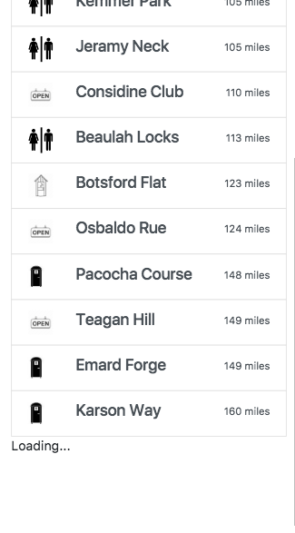
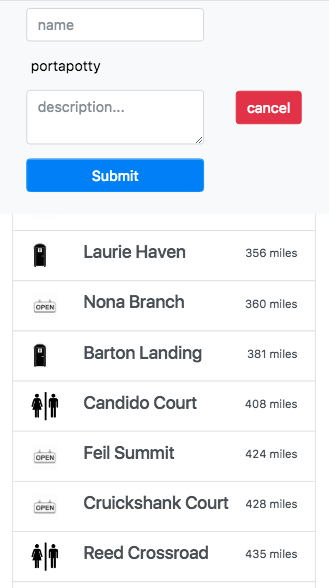
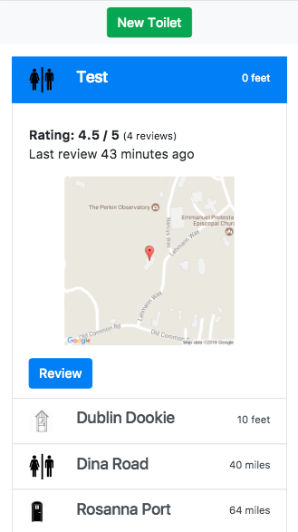
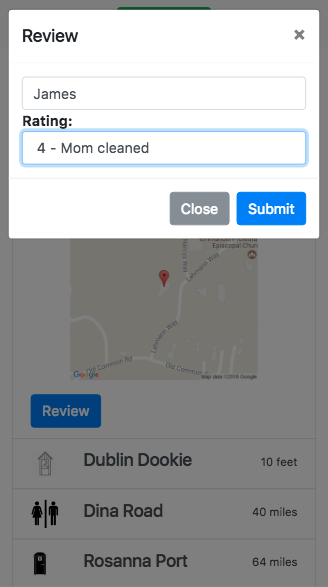

# JOHN
live [here](https://evening-gorge-10795.herokuapp.com)

Sample login credentials

U: example@app.com

P: ketchum

A simple single-page responsive web application for locating toilets. Toilet locations are crowd-sourced and georeferenced using the HTML5 geolocation service. The index of toilets is ordered by the distance from the user. Users can review toilets as well. Rating statistics, a map showing the toilet and the user's current location, and a description are included as a dropdown for each toilet.

## Code
John is a single-page web application built on the rails framework. The rails framework serves both AJAX requests and HTML partials. The Bootstrap library is used to style the page. The page elements are manipulated using jQuery rendered as js scripts from the rails controller. Some notable features are detailed below.

### Infinite Scroll
Toilets are loaded lazily using the **will_paginate** gem and **AJAX** requests to *toilets#index*.

### New Toilet
The header transforms into a form to create a new toilet. The current location is determined using the HTML5 geolocation service and stored as a hidden field.

### Show Toilet
When clicked, the toilet list item includes a dropdown with more details, included a static map from the google api. The user's current location is included on the map as a green marker.

### Review Modal
Users can review toilets by clicking on the review button, which triggers a modal form.

## Technologies
  * Bootstrap
  * Rails
  * jQuery
  * AJAX

## TODO
- [ ] Implement passwordless user authentication
  * Maybe google oath2
- [ ] Include more description and review options
  * Could remove old unused toilets or move them down in the index.
  * Differentiate toilets further based on style
  * Pictures? Probably not...

  
